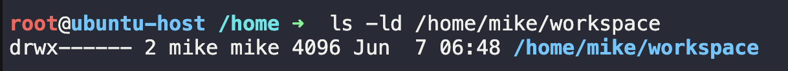

#### Create new local git repository

``` 
git init
touch readme.md
git remote add origin https://github.com/abhijeetchavan9243/linux_assignment_HeroVired.git
git branch -m master main
git add readme.md
git commit -m "first commit"
git push -u origin main
```

# Task 1 System Monitoring Setup

#### Install monitoring setup
##### htop: real-time view of CPU, memory, and process usage.
##### nmon: interactive system performance tool.
``` 
sudo apt update
sudo apt install -y htop nmon crontab
```

#### Create a monitoring script file
`sudo nano /usr/local/bin/system_monitor.sh`

##### Paste the below script in the file
``` 
#!/bin/bash
LOG_DIR="/var/log/monitor"
DATE=$(date +%F)

mkdir -p $LOG_DIR

# htop snapshot
# htop -b -n 1 > $LOG_DIR/htop_$DATE.log

# top snapshot
top -b -n 1 > $LOG_DIR/top_$DATE.log

# disk usage
df -h > $LOG_DIR/disk_usage_$DATE.log
du -sh /home/* >> $LOG_DIR/disk_usage_$DATE.log

# top processes
ps aux --sort=-%cpu | head -10 > $LOG_DIR/high_usage_$DATE.log
ps aux --sort=-%mem | head -10 >> $LOG_DIR/high_usage_$DATE.log
```


#### To make script executable
`chmod +x /usr/local/bin/system_monitor.sh`

#### Edit cron tab and add new cron job for running script automatically
``` 
crontab -e
0 1 * * * /usr/local/bin/system_monitor.sh
sudo systemctl status cron
```

## htop does not run non-interactively hence using top
---

# Task 2 User Management and Access Control

#### Create User Accounts
``` 
sudo adduser sarah
sudo adduser mike
```


#### Create Dedicated Workspaces
``` 
sudo mkdir -p /home/sarah/workspace
sudo mkdir -p /home/mike/workspace
```

#### Set Ownership and Permissions
``` 
sudo chown -R sarah:sarah /home/sarah/workspace
sudo chmod 700 /home/sarah/workspace

sudo chown -R mike:mike /home/mike/workspace
sudo chmod 700 /home/mike/workspace
```



#### Enforce Password Policy
``` 
sudo chage -M 30 sarah
sudo chage -M 30 mike
```


#### Enforce complexity rules
##### Edit /etc/pam.d/common-password
``` 
password requisite pam_pwquality.so retry=3 minlen=8 ucredit=-1 lcredit=-1 dcredit=-1
```
---

# Task 3 Backup Configuration for Web Servers


---